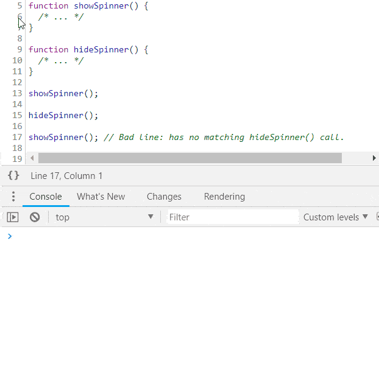
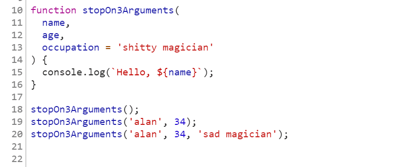

# 67 странных трюков отладки

Список полезных и неочевидных хаков, позволяющих получить максимальную отдачу от отладчика вашего браузера[^1]. Предполагает понимание инструментов разработчика на среднем или более высоком уровне.

[^1]: Советы поддерживаются в Chrome, Firefox и Edge, если на логотипах браузеров не указано иное: <xdev-browser browser="chrome"></xdev-browser> <xdev-browser browser="firefox"></xdev-browser> <xdev-browser browser="edge"></xdev-browser>

## Расширенные условные точки останова

Используя выражения, которые имеют побочные эффекты там, где вы не ожидаете, мы можем выжать больше функциональности из базовых функций, таких как условные точки останова.

### Логпойнты/Трасепойнты

Например, мы можем использовать `console.log` в точках останова. Логпоинты - это точки останова, которые выводят журнал в консоль без приостановки выполнения. В то время как Microsoft Edge уже давно имеет встроенные точки останова, а Chrome только что добавил их в v73, в Firefox их нет. Но мы можем использовать условные точки останова для их имитации в любом браузере.


Используйте `console.count` вместо `console.log`, если вам также нужен бегущий счетчик того, сколько раз была выполнена строка.

!!!warning "ОБНОВЛЕНИЕ (май 2020 года)"

    Все основные браузеры теперь напрямую поддерживают логпоинты/трасспоинты ([Chrome Logpoints](https://developers.google.com/web/updates/2019/01/devtools#logpoints), [Edge Tracepoints](https://docs.microsoft.com/en-us/microsoft-edge/devtools-guide/debugger#breakpoints), [Firefox Logpoints](https://developer.mozilla.org/docs/Tools/Debugger/Set_a_logpoint))

#### Панель наблюдения

Вы также можете использовать `console.log` в панели наблюдения. Например, чтобы сбрасывать снимок `localStorage` каждый раз, когда ваше приложение приостанавливается в отладчике, вы можете создать часы `console.table(localStorage)`:


Или, чтобы выполнить выражение после мутации DOM, установите точку останова мутации DOM (в инспекторе элементов):


А затем добавьте свое выражение watch, например, для записи снимка DOM: `(window.doms = window.doms || []).push(document.documentElement.outerHTML)`. Теперь, после любого изменения поддерева DOM, отладчик приостановит выполнение, и новый снимок DOM будет находиться в конце массива `window.doms`. (Не существует способа создать точку останова для мутации DOM, которая не приостанавливала бы выполнение).

#### Трассировка стеков вызовов

Допустим, у вас есть функция, которая показывает загрузочный спиннер, и функция, которая его скрывает, но где-то в вашем коде вы вызываете метод `show` без соответствующего вызова hide. Как найти источник непарного вызова `show`? Используйте `console.trace` в условной точке останова в методе `show`, запустите свой код, найдите последнюю трассировку стека для метода `show` и щелкните по вызывающему методу, чтобы перейти к коду:



### Изменение поведения программы

Используя выражения, которые имеют побочные эффекты на поведение программы, мы можем изменять поведение программы на лету, прямо в браузере.

Например, вы можете переопределить параметр функции `getPerson`, `id`. Поскольку `id=1` оценивается как true, эта условная точка останова приостановит работу отладчика. Чтобы предотвратить это, добавьте `, false` к выражению.


### Быстрое и грязное профилирование производительности

Не стоит засорять профилирование производительности такими вещами, как время оценки условных точек останова, но если вам нужно быстро и грязно измерить, сколько времени занимает выполнение какого-либо действия, вы можете использовать консольный API тайминга в условных точках останова. В начальной точке установите точку останова с условием `console.time('label')`, а в конечной точке установите точку останова с условием `console.timeEnd('label')`. Каждый раз, когда будет выполняться измеряемое вами действие, браузер будет выводить в консоль журнал о том, сколько времени оно занимает.


### Использование функции Arity

#### Прерывание по количеству аргументов

Делайте паузу только в том случае, если текущая функция вызывается с 3 аргументами: `arguments.callee.length === 3`.

Пригодится, если у вас есть перегруженная функция с необязательными параметрами.



#### Прерывание при несоответствии арности функции

Пауза возникает только в том случае, если текущая функция вызывается с неправильным количеством аргументов: `(arguments.callee.length) != arguments.length`


Полезно при поиске ошибок в местах вызова функций.

### Использование времени

#### Пропустить загрузку страницы

Не делайте паузу до 5 секунд после загрузки страницы: `performance.now() > 5000`.

Полезно, когда вы хотите установить точку останова, но вас интересует только приостановка выполнения после начальной загрузки страницы.

#### Пропустить N секунд

Не приостанавливайте выполнение, если точка останова будет достигнута в течение следующих 5 секунд, но приостанавливайте выполнение в любое время после этого: `window.baseline = window.baseline || Date.now(), (Date.now() - window.baseline) > 5000`.

Сбросьте счетчик из консоли в любое время: `window.baseline = Date.now()`.

### Использование CSS

Приостановка на основе вычисленных значений CSS, например, приостанавливать выполнение только тогда, когда тело документа имеет красный цвет фона: `window.getComputedStyle(document.body).backgroundColor === "rgb(255,0,0)"`.

### Только четные вызовы

Делайте паузу только при каждом втором выполнении строки: `window.counter = window.counter || 0, window.counter % 2 === 0`

### Break on Sample

Выполняйте прерывание только при случайной выборке выполнения строки, например, прерывайте только 1 из каждых 10 раз выполнения строки: `Math.random() < 0.1`

### Never Pause Here

<xdev-browser browser="chrome"></xdev-browser>

Когда вы щелкаете правой кнопкой мыши по желобу и выбираете "Never Pause Here", Chrome создает условную точку останова, которая будет `false` и никогда не пройдет. Таким образом, отладчик никогда не будет останавливаться на этой строке.


Пригодится, если вы хотите освободить строку от точек останова XHR, проигнорировать возникающее исключение и т. д.

### Автоматические идентификаторы экземпляров

Автоматически присваивайте уникальный ID каждому экземпляру класса, установив эту условную точку останова в конструкторе: `(window.instances = window.instances || []).push(this)`.

Затем для получения уникального идентификатора: `window.instances.indexOf(instance)` (например, `window.instances.indexOf(this)` в методе класса)

### Программное переключение

Используйте глобальное булево значение для установки одной или нескольких условных точек останова:


Затем программно переключите булево значение, например

-   вручную, из консоли

    ```javascript
    window.enableBreakpoints = true;
    ```

-   из других точек останова

    

-   с таймера на консоли

    ```javascript
    setTimeout(
        () => (window.enableBreakpoints = true),
        5000
    );
    ```

-   прочее

## `monitor()` class Calls

<xdev-browser browser="chrome"></xdev-browser>

Вы можете использовать метод командной строки Chrome `monitor`, чтобы легко отследить все вызовы методов класса. Например, задан класс `Dog`

```javascript
class Dog {
    bark(count) {
        /* ... */
    }
}
```

Если мы хотим узнать все вызовы, сделанные для всех экземпляров `Dog`, вставьте это в командную строку:

```javascript
var p = Dog.prototype;
Object.getOwnPropertyNames(p).forEach((k) => monitor(p[k]));
```

и вы получите вывод в консоли:

```
> function bark called with arguments: 2
```

Вы можете использовать `debug` вместо `monitor`, если хотите приостановить выполнение при любом вызове метода (вместо того, чтобы просто вести журнал в консоли).

### Из конкретного экземпляра

<xdev-browser browser="chrome"></xdev-browser>

Если вы не знаете класс, но у вас есть его экземпляр:

```javascript
var p = instance.constructor.prototype;
Object.getOwnPropertyNames(p).forEach((k) => monitor(p[k]));
```

Пригодится, если вы хотите написать функцию, которая делает это для любого экземпляра любого класса (а не только для `Dog`)

## Вызов и отладка функции

Перед вызовом функции, которую вы хотите отладить в консоли, вызовите `debugger`. Например:

```javascript
function fn() {
    /* ... */
}
```

Из консоли:

```
> debugger; fn(1);
```

А затем "Step into next function call" для отладки реализации `fn`.

Полезно, если вам не хочется искать определение `fn` и добавлять точку останова вручную или если `fn` динамически привязана к функции и вы не знаете, где находится ее исходный текст.

В Chrome вы также можете опционально вызвать `debug(fn)` в командной строке, и отладчик будет приостанавливать выполнение внутри `fn` при каждом ее вызове.

## Приостановка выполнения при изменении URL

Чтобы приостановить выполнение перед тем, как одностраничное приложение изменит URL (т. е. произойдет какое-то событие маршрутизации):

```javascript
const dbg = () => {
    debugger;
};
history.pushState = dbg;
history.replaceState = dbg;
window.onhashchange = dbg;
window.onpopstate = dbg;
```

Создание версии `dbg`, которая приостанавливает выполнение, не нарушая навигацию, - это упражнение, оставленное на усмотрение читателя.

Также обратите внимание, что это не помогает, когда код вызывает `window.location.replace/assign` напрямую, потому что страница немедленно выгружается после назначения, так что отлаживать нечего. Если вы все же хотите увидеть источник этих перенаправлений (и отладить свое состояние в момент перенаправления), в Chrome вы можете `отладить` соответствующие методы:

```javascript
debug(window.location.replace);
debug(window.location.assign);
```

## Отладка чтения свойств

Если у вас есть объект и вы хотите знать, когда у него читается какое-либо свойство, используйте геттер объекта с вызовом `debugger`. Например, преобразуйте `{configOption: true}` в `{get configOption() { debugger; return true; }}` (либо в исходном коде, либо с помощью условной точки останова).

Полезно, когда вы передаете какие-то параметры конфигурации чему-то и хотите посмотреть, как они используются.

## Используйте `copy()`

<xdev-browser browser="chrome"></xdev-browser> <xdev-browser browser="firefox"></xdev-browser>

С помощью консольного API `copy()` можно скопировать интересную информацию из браузера прямо в буфер обмена без обрезания строк. Некоторые интересные вещи, которые вы можете захотеть скопировать:

-   Снимок текущего DOM: `copy(document.documentElement.outerHTML)`.
-   Метаданные о ресурсах (например, изображениях): `copy(performance.getEntriesByType("resource"))`.
-   Большой JSON-блоб, отформатированный: `copy(JSON.parse(blob))`.
-   Дамп вашего локального хранилища: `copy(localStorage)`.
-   И т.д.

## Отладка HTML/CSS

Консоль JS может быть полезна при диагностике проблем с HTML/CSS.

### Осмотр DOM с отключенным JS

Находясь в инспекторе DOM, нажмите ++ctrl+backslash++ (Chrome/Windows), чтобы приостановить выполнение JS в любой момент. Это позволит вам просмотреть снимок DOM, не беспокоясь о том, что JS изменит DOM или события (например, mouseover) заставят DOM измениться под вами.

### Осмотр неуловимого элемента

Допустим, вы хотите проинспектировать элемент DOM, который появляется только условно. Чтобы осмотреть этот элемент, нужно подвести к нему мышь, но при попытке это сделать он исчезает:


Для проверки элемента вы можете вставить в консоль следующее: `setTimeout(function() { debugger; }, 5000);`. Это даст вам 5 секунд для запуска UI, а затем, как только истечет 5-секундный таймер, выполнение JS приостановится, и ничто не заставит ваш элемент исчезнуть. Вы можете свободно перемещать мышь к инструментам разработчика, не теряя элемент:


Пока выполнение JS приостановлено, вы можете осматривать элемент, редактировать его CSS, выполнять команды в консоли JS и т. д.

Полезно при осмотре DOM, который зависит от конкретной позиции курсора, фокуса и т. д.

### Запись моментальных снимков DOM

Чтобы получить копию DOM в его текущем состоянии:

```javascript
copy(document.documentElement.outerHTML);
```

Для записи снимка DOM каждую секунду:

```javascript
doms = [];
setInterval(() => {
    const domStr = document.documentElement.outerHTML;
    doms.push(domStr);
}, 1000);
```

Или просто сбросьте его на консоль:

```javascript
setInterval(() => {
    const domStr = document.documentElement.outerHTML;
    console.log('snapshotting DOM: ', domStr);
}, 1000);
```

### Наблюдение за сфокусированным элементом

```javascript
(function () {
    let last = document.activeElement;
    setInterval(() => {
        if (document.activeElement !== last) {
            last = document.activeElement;
            console.log('Focus changed to: ', last);
        }
    }, 100);
})();
```


### Поиск жирных элементов

```javascript
const isBold = (e) => {
    let w = window.getComputedStyle(e).fontWeight;
    return w === 'bold' || w === '700';
};
Array.from(document.querySelectorAll('*')).filter(isBold);
```

#### Только потомки

Или просто потомки элемента, выбранного в данный момент в инспекторе:

```javascript
Array.from($0.querySelectorAll('*')).filter(isBold);
```

### Ссылка на выбранный в данный момент элемент

`$0` в консоли - это автоматическая ссылка на текущий выбранный элемент в инспекторе элементов.

#### Предыдущие элементы

<xdev-browser browser="chrome"></xdev-browser> <xdev-browser browser="edge"></xdev-browser>

В Chrome и Edge вы можете получить доступ к элементу, который вы проверяли последним, с помощью `$1`, к элементу перед этим с помощью `$2` и т. д.

#### Получение слушателей событий

<xdev-browser browser="chrome"></xdev-browser>

В Chrome вы можете просмотреть слушателей событий текущего выбранного элемента: `getEventListeners($0)`, например.


### Мониторинг событий для элемента

<xdev-browser browser="chrome"></xdev-browser>

Отладка всех событий для выбранного элемента: `monitorEvents($0)`.

Отладка конкретных событий для выбранного элемента: `monitorEvents($0, ["control", "key"])`.


## Источник

-   [67 Weird Debugging Tricks Your Browser Doesn't Want You to Know](https://alan.norbauer.com/articles/browser-debugging-tricks)
