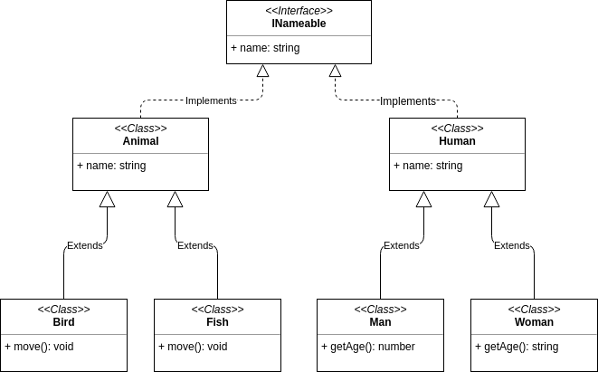
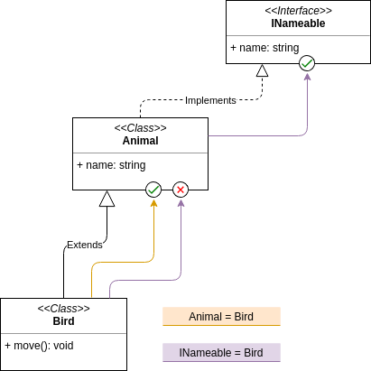
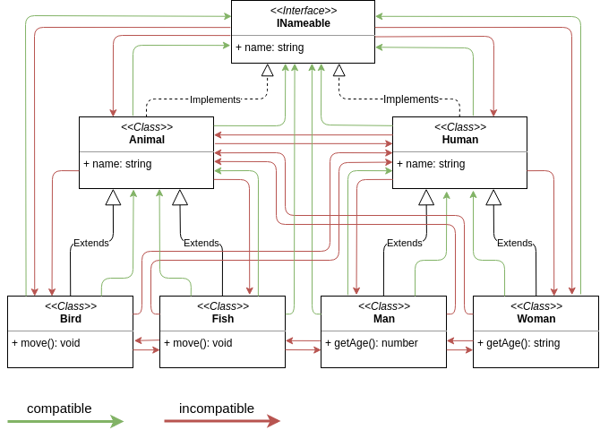
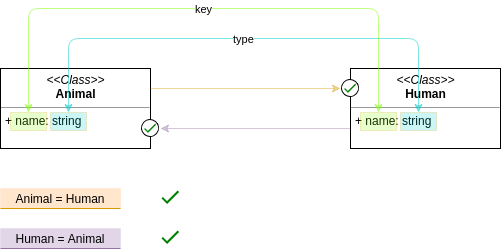

# Совместимость типов на основе вида типизации

Каждый раз при присваивании значения компилятор подвергает его проверке на совместимость с ожидаемым типом. Компилятор словно секьюрити, стоящий на фейсконтроле ночного клуба, решает пропускать или нет то, или иное значение. Подобные решения принимаются на основании правил, которые зависят не только клуба (языка программирования), но также вида проводимых мероприятий. Понять логику на которую опирается компилятор при определении совместимости нам поможет текущая и следующая глава. Но сначала давайте выведем правило самой совместимости.

## Совместимость типов

_Совместимость типов_ (Types Compatibility) — это совокупность правил, на основе которых программа, анализируя два типа, принимает решение о возможности одного типа заменить на другой таким образом, чтобы замена не нарушила выполнение программы. Простыми словами, совместимость типов — это механизм, по которому происходит сопоставление типов.

Существует несколько основных механизмов и выбор конкретного зависит от случая, при котором возникает потребность сопоставления типов данных. Один из таких механизмов состоит из совокупности правил, составляющих такое понятие, как типизация. Из существующего множества правил можно выделить несколько групп, которые образуют три вида типизации — _номинативную_, _структурную_ и _утиную_.

Чтобы различия между ними были более очевидными, все они будут рассматриваться на одном примере, диаграмма которого показана ниже.

## Номинативная Типизация

_Номинативная типизация_ (nominative typing) устанавливает совместимость типов основываясь на идентификаторах типов (ссылках). Простыми словами, при проверке на совместимость компилятор проверяет иерархию типов на признаки наследования и реализацию интерфейсов. То есть, тип `B` будет совместим с типом `A` только тогда, когда он является его предком (`extends`). Кроме того, тип `B` будет совместим с интерфейсом `IA` только в том случае, если он или один из его предков реализует его явно (`implements`).

Как можно понять по изображению выше, при проверке на совместимость типа `Bird` с типом `Animal` компилятор обходит дерево в поисках наличия ссылки на тип `Animal` и обнаружив её, приходит к выводу, что типы совместимы. Тот же самый процесс требуется для установления совместимости типа `Bird` с типом интерфейса `INameable`. Полная картина совместимости изображена на диаграмме ниже.

Номинативная типизация присуща исключительно статически типизированным языкам.

К языкам с номинативной типизацией относятся _Java_, _C#_ и другие.

## Структурная Типизация

_Структурная типизация_ (structural typing) — это принцип, определяющий совместимость типов основываясь не на иерархии наследования или явной реализации интерфейсов, а на их описании.

Компилятор считает типы совместимыми, если сопоставляемый тип имеет все признаки типа, с которым сопоставляется. Чтобы быть совместимым, сопоставляемый тип должен иметь те же ключи с теми же (идентичными или совместимыми) типами что и тип, с которым происходит сопоставление. Полная картина совместимости в структурной типизации изображена на диаграмме ниже.

Структурная типизация присуща исключительно языкам с явной типизацией (глава [Сильная и слабая типизация](007.md)).

К языкам со структурной типизацией относятся _TypeScript_, _Scala_ и им подобные.

## Утиная Типизация

_Утиная типизация_ (Duck typing), как и в случае со структурной типизацией — это принцип, определяющий совместимость типов основываясь не на иерархии наследования или явной реализации интерфейсов, а на их описании. Утиная типизация ничем не отличается от структурной, за исключением того, что присуща лишь языкам с _динамическим связыванием_ (динамическая типизация).

Термин «Утиная типизация» произошёл от английского выражения _duck test_, который в оригинале звучит как -
_Если это выглядит как утка, плавает как утка и крякает как утка, то это, вероятно, и есть утка_.

Так как утиная типизация не отличается от структурной, то в качестве примеров совместимости можно воспользоваться диаграммой из предыдущего раздела, посвященного структурной типизации.

К языкам с утиной типизацией относятся _Python_, _JavaScript_ и другие.
